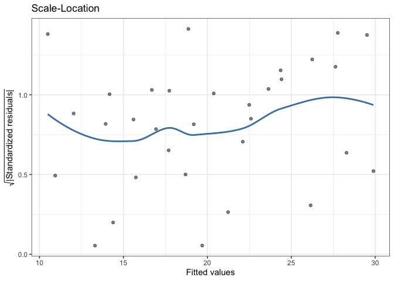
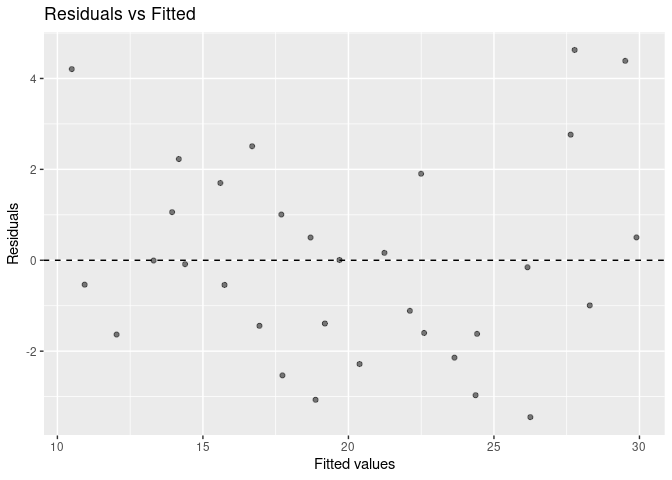
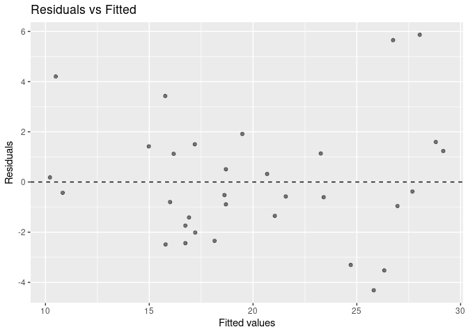
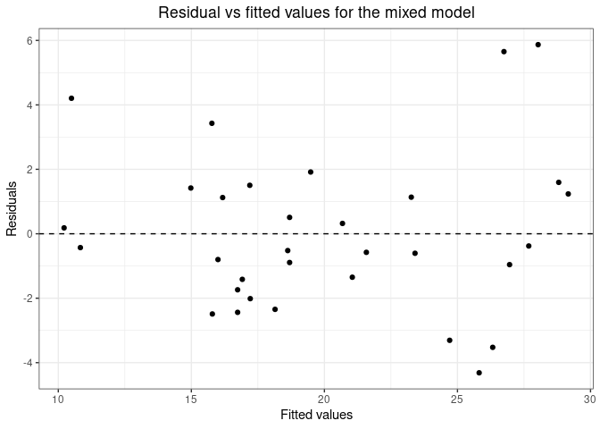

<!-- badges: start -->

[](https://cran.r-project.org/package=gglm)
[](https://github.com/graysonwhite/gglm/actions/workflows/R-CMD-check.yaml)
<!-- badges: end -->

# gglm 

## Overview

`gglm`, The Grammar of Graphics for Linear Model Diagnostics, is an R
package and [official `ggplot2`
extension](https://exts.ggplot2.tidyverse.org/gallery/) that creates
beautiful diagnostic plots using `ggplot2` for a variety of model
objects. These diagnostic plots are easy to use and adhere to the
Grammar of Graphics. The purpose of this package is to provide a
sensible alternative to using the base-R `plot()` function to produce
diagnostic plots for model objects. Currently, `gglm` supports all model
objects that are supported by `broom::augment()`,
`broom.mixed::augment()`, or `ggplot2::fortify()`. For example, objects
that are outputted from `stats::lm()`, `lme4::lmer()`, `brms::brm()`,
and many other common modeling functions will work with `gglm`. The
function `gglm::list_model_classes()` provides a full list of model
classes supported by `gglm`.

## Installation

`gglm` can be installed from CRAN:

``` r
install.packages("gglm")
```

Or, the developmental version of `gglm` can be installed from GitHub:

``` r
devtools::install_github("graysonwhite/gglm")
```

## Examples

`gglm` has two main types of functions. First, the `gglm()` function is
used for quickly creating the four main diagnostic plots, and behaves
similarly to how `plot()` works on an `lm` type object. Second, the
`stat_*()` functions are used to produce diagnostic plots by creating
`ggplot2` layers. These layers allow for plotting of particular model
diagnostic plots within the `ggplot2` framework.

### Example 1: Quickly creating the four diagnostic plots with `gglm()`

Consider a simple linear model used to predict miles per gallon with
weight. We can fit this model with `lm()`, and then diagnose it easily
by using `gglm()`.

``` r
library(gglm) # Load gglm

model <- lm(mpg ~ wt, data = mtcars) # Fit the simple linear model

gglm(model) # Plot the four main diagnostic plots
```

<!-- -->

Now, one may be interested in a more complicated model, such as a mixed
model with a varying intercept on `cyl`, fit with the `lme4` package.
Luckily, `gglm` accommodates a variety of models and modeling packages,
so the diagnostic plots for the mixed model can be created in the same
way as they were for the simple linear model.

``` r
library(lme4) # Load lme4 to fit the mixed model

mixed_model <- lmer(mpg ~ wt + (1 | cyl), data = mtcars) # Fit the mixed model

gglm(mixed_model) # Plot the four main diagnostic plots.
```

<!-- -->

### Example 2: Using the Grammar of Graphics with the `stat_*()` functions

`gglm` also provides functionality to stay within the Grammar of
Graphics by providing functions that can be used as `ggplot2` layers. An
example of one of these functions is the `stat_fitted_resid()` function.
With this function, we can take a closer look at just the fitted
vs. residual plot from the mixed model fit in Example 1.

``` r
ggplot(data = mixed_model) +
  stat_fitted_resid()
```

<!-- -->

After taking a closer look, we may want to clean up the look of the plot
for a presentation or a project. This can be done by adding other layers
from `ggplot2` to the plot. Note that any `ggplot2` layers can be added
on to any of the `stat_*()` functions provided by `gglm`.

``` r
ggplot(data = mixed_model) +
  stat_fitted_resid(alpha = 1) + 
  theme_bw() + # add a clean theme 
  labs(title = "Residual vs fitted values for the mixed model") + # change the title
  theme(plot.title = element_text(hjust = 0.5)) # center the title
```

<!-- -->

Wow! What a beautiful and production-ready diagnostic plot!

## Functions

### For quick and easy plotting

`gglm()` plots the four default diagnostic plots when supplied a model
object (this is similar to `plot.lm()` in the case of an object
generated by `lm()`). Note that can `gglm()` take many types of model
object classes as its input, and possible model object classes can be
seen with `list_model_classes()`

### Following the Grammar of Graphics

`stat_normal_qq()`, `stat_fitted_resid()`, `stat_resid_hist()`,
`stat_scale_location()`, `stat_cooks_leverage()`, `stat_cooks_obs()`,
and `stat_resid_leverage()` all are `ggplot2` layers used to create
individual diagnostic plots. To use these, follow Example 2.

### Other functions

`list_model_classes()` lists the model classes compatible with `gglm`.
