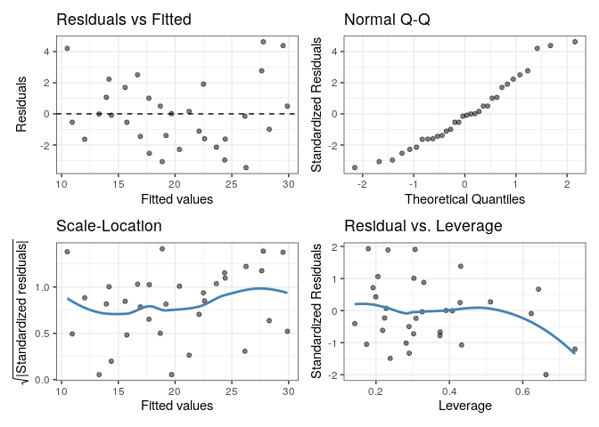
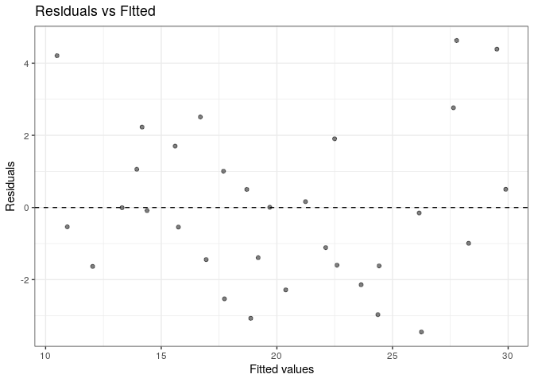

gglm: Grammar of Graphics for (Generalized) Linear Model Diagnostics
====================================================================

Overview
--------

`gglm` is a package that creates beautiful `ggplot2` diagonostic plots of generalized linear models that adhere to the Grammar of Graphics and are easy to use.

Installation
------------

``` r
# Currently, the best way to install is from GitHub.
devtools::install_github("graysonwhite/gglm")
```

Examples
--------

`gglm` has two main goals: (1) quickly create the four main diagnostics plots, similarly to when you call `plot()` on an `lm` or `glm` type object, and (2) produce diagnostic plots the align with the Grammar of Graphics by creating `ggplot2` layers that allow for easy plotting of particular model diagnostic plots.

### Example 1: Quickly creating the four diagnostic plots

``` r
library(gglm)
library(ggplot2)
data(mtcars) # Load example data
m1 <- lm(mpg ~ ., data = mtcars) # Create your model

gglm(m1)
```



### Example 2: Using the Grammar of Graphics

``` r
library(gglm) 
library(ggplot2)
data(mtcars) # Load example data
model <- lm(mpg ~ ., data = mtcars) # Create your model

ggplot(data = model) +
  stat_fitted_resid()
```



Functions
---------

### For quick and easy plotting

`gglm()` plots the four default diagnostic plots when supplied an `lm` or `glm` object. This function works similarly to `plot.lm()`, except that it displays the four diagnostic plots at once.

### Following the Grammar of Graphics

`stat_normal_qq()`, `stat_fitted_resid()`, `stat_resid_hist()`, `stat_scale_location()`, `stat_cooks_leverage()`, and `stat_resid_leverage()` all are `ggplot2` layers used to create individual diagnostic plots. To use these, follow Example 2.

### Coming soon

`stat_cook()` vs. observation number
