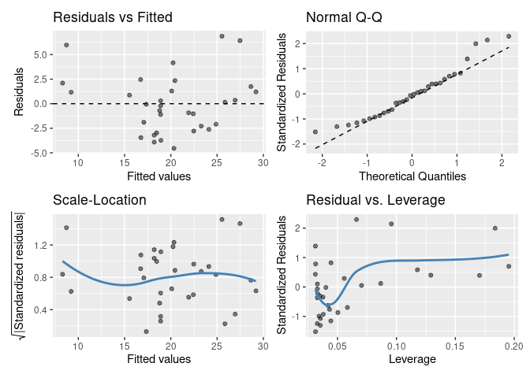
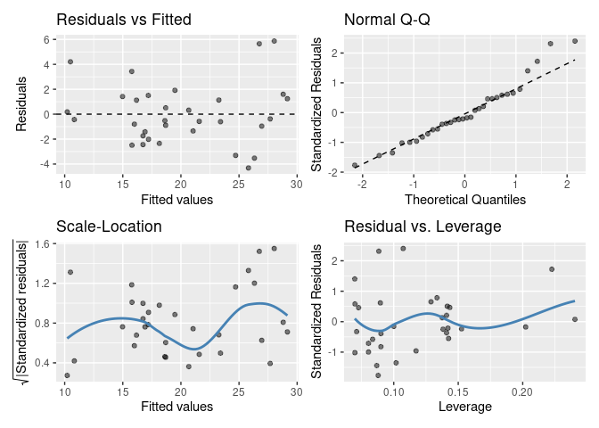

# gglm 

## Overview

`gglm`, The **G**rammar of **G**raphics for **L**inear **M**odel
Diagnostics, is a package that creates beautiful `ggplot2` diagonostic
plots for linear models that are easy to use and adhere to The Grammar
of Graphics. The purpose of this package is to provide a sensible
alternative to using the base-R `plot()` function to produce diagnostic
plots for linear models.

## Installation

``` r
# Currently, the best way to install is from GitHub.
devtools::install_github("graysonwhite/gglm")
```

## Examples

`gglm` has two main types of functions. First, the `gglm()` function for
quickly creating the four main diagnostic plots, similar to when you
call `plot()` on an `lm` type object. Second, the `stat_*()` functions,
which produce diagnostic plots the align with The Grammar of Graphics by
creating `ggplot2` layers that allow for easy plotting of particular
model diagnostic plots.

### Example 1: Quickly creating the four diagnostic plots with `gglm()`

``` r
library(gglm) # Load the package
data(mtcars) # Load example data
model <- lm(mpg ~ ., data = mtcars) # Create your model

gglm(model) # Plot the four main diagnostic plots
```

<!-- -->

### Example 2: Using the Grammar of Graphics with the `stat_*()` functions

``` r
library(ggplot2) # Need to load ggplot2

ggplot(data = model) +
  stat_fitted_resid()
```

<!-- -->

``` r
# We can also add layers such as themes to these `ggplot`s and adjust features of the plot:
ggplot(data = model) +
  stat_cooks_leverage(alpha = 1) +
  theme_minimal()
```

<!-- -->

## Functions

### For quick and easy plotting

`gglm()` plots the four default diagnostic plots when supplied an `lm`
object. This function works similarly to `plot.lm()`, except that it
displays the four diagnostic plots at once.

### Following the Grammar of Graphics

`stat_normal_qq()`, `stat_fitted_resid()`, `stat_resid_hist()`,
`stat_scale_location()`, `stat_cooks_leverage()`, `stat_cooks_obs()`,
and `stat_resid_leverage()` all are `ggplot2` layers used to create
individual diagnostic plots. To use these, follow Example 2.
